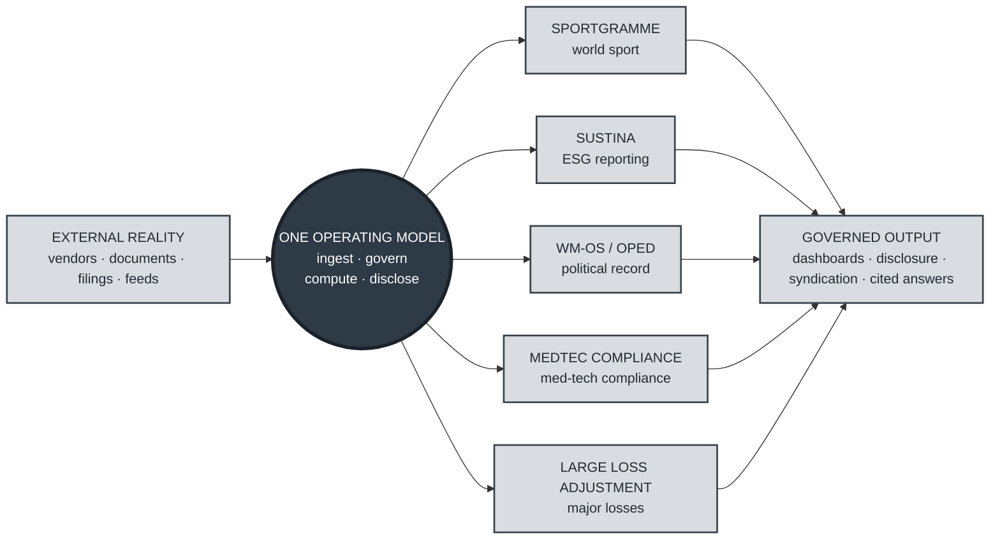

# Neil Watcyn-Palmer

**Founder and designer of governed-data platforms — a family of domain-specific
"single source of truth" products, each built the same way and held to the same
standard.**

Each venture takes the messy reality of one domain — world sport, corporate
emissions, the political record, medical-technology compliance, major losses — and
turns it into audited, decision-ready output. They don't share data; they share a
way of working: **govern first, compute in the open, disclose with a citation.**

## The portfolio

| Product | Organisation | What it is |
|---|---|---|
| **Sportgramme** | [sportgramme](https://github.com/sportgramme) | The single source of truth for world sport — data, media and market intelligence, unified and syndicated globally |
| **Sustina** | [sustina-nrgpix](https://github.com/sustina-nrgpix) | ESG and sustainability reporting for business — one governed data foundation, audited Scope 1, 2 and 3 disclosure delivered as a service |
| **WM-OS** | [wm-os-com](https://github.com/wm-os-com) | Continuous political analysis and lobbying monitoring — the public record of Parliament turned into decision-ready intelligence |
| **OPED** | [oped-wm-os](https://github.com/oped-wm-os) | A knowledge base and analysis of the debate shaping political policy and decision-making globally |
| **MedTec Compliance** | [MedTec-Compliance](https://github.com/MedTec-Compliance) | Medical-technology regulatory compliance and clinical knowledge, backed by an on-premise, cited-source assistant |
| **Large Loss Adjustment** | [LargeLoss](https://github.com/LargeLoss) | Knowledge and predictive models for major marine, mining and insurance losses |

## One operating model

Every product is built the same way:

- **Governed data first.** Strong controls — default-deny access, centralised
  roles, row-level security, full temporal history, and before/after audit — go
  in *before* the first application table. The data describes identifiable third
  parties and sensitive operations, so GDPR and client confidentiality are
  designed in, not bolted on.
- **A thin, guarded architecture.** React on the browser, a thin ASP.NET Core
  proxy, and C# business logic on AWS Lambda. Secrets and SQL stay behind the
  Lambda boundary; developers never touch the databases directly.
- **An on-premise knowledge base.** Each product runs its own
  retrieval-augmented assistant inside its own boundary, drawing only on vetted
  internal material and citing every answer. Client data and proprietary detail
  are never sent to an external model.
- **Documented as value, not internals.** Capabilities are written as
  *As a / I want / So that* briefs with conceptual diagrams — what a thing does
  and why it matters — for reviewers and partners.

## Organisations

| Organisation | Site |
|---|---|
| [github.com/sportgramme](https://github.com/sportgramme) | sportgramme.com |
| [github.com/sustina-nrgpix](https://github.com/sustina-nrgpix) | sustina.nrgpix.com |
| [github.com/wm-os-com](https://github.com/wm-os-com) | wm-os.com |
| [github.com/oped-wm-os](https://github.com/oped-wm-os) | oped.wm-os.com |
| [github.com/MedTec-Compliance](https://github.com/MedTec-Compliance) | — |
| [github.com/LargeLoss](https://github.com/LargeLoss) | — |

---
Copyright © 2024–2026 Neill Watcyn-Palmer. All rights reserved. Proprietary.
